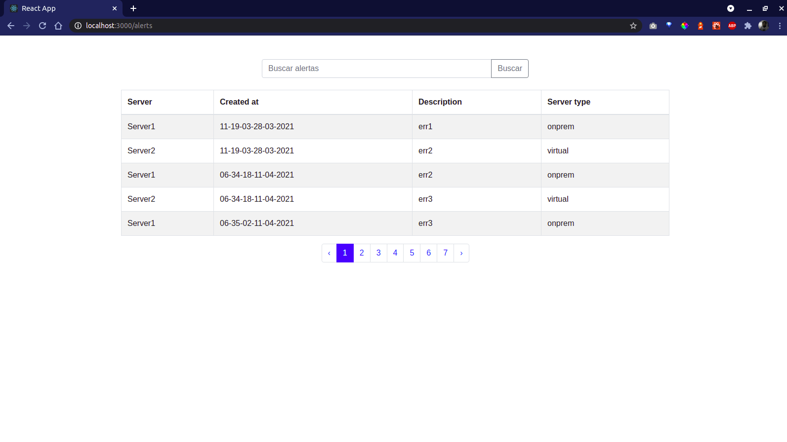

# Descripción
<p>App para visualización de alertas con búsqueda y paginación en React JS y Node.js.</p>

# Screen


# Tener instalado
<ul>
    <li>React JS</li>
    <li>npm v6+</li>
</ul>

# ¿Cómo iniciar el proyecto?
```bash
git clone https://github.com/arieelarg/front_meli_app
cd [mercadolibre_app]
npm i && npm start
```

# Tecnologías
<ul>
    <li>React JS</li>
    <li>React Router DOM</li>
    <li>React Testing Library</li>
    <li>Bootstrap</li>
</ul>

# Agradecimientos
<p>Gracias <b>MercadoLibre</b> por la oportunidad y el tiempo.</p>